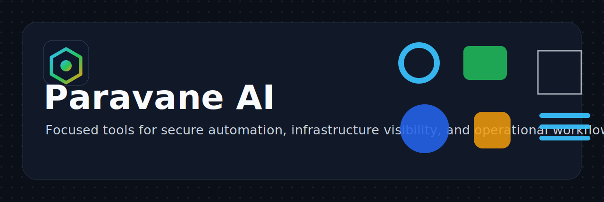

  

## Build With Paravane AI

Paravane AI builds focused tools for secure automation, infrastructure visibility, and operational workflows.

Our work centers on practical systems that make complex environments easier to inspect, operate, and trust.

## Projects

- [File Browser Desktop](https://github.com/paravaneai/filebrowser-desktop)  
  A Windows desktop client for private File Browser access over SSH tunnels.

## Focus Areas

- Secure server access patterns
- Desktop tooling for operational workflows
- Automation that keeps human review in the loop
- Clear documentation, packaging, and release hygiene

## Get Involved

- Explore our public repositories.
- Open issues for bugs and feature requests.
- Review each repository's `SECURITY.md` before reporting vulnerabilities.

---

Paravane AI projects follow their repository code of conduct and security disclosure guidance.
